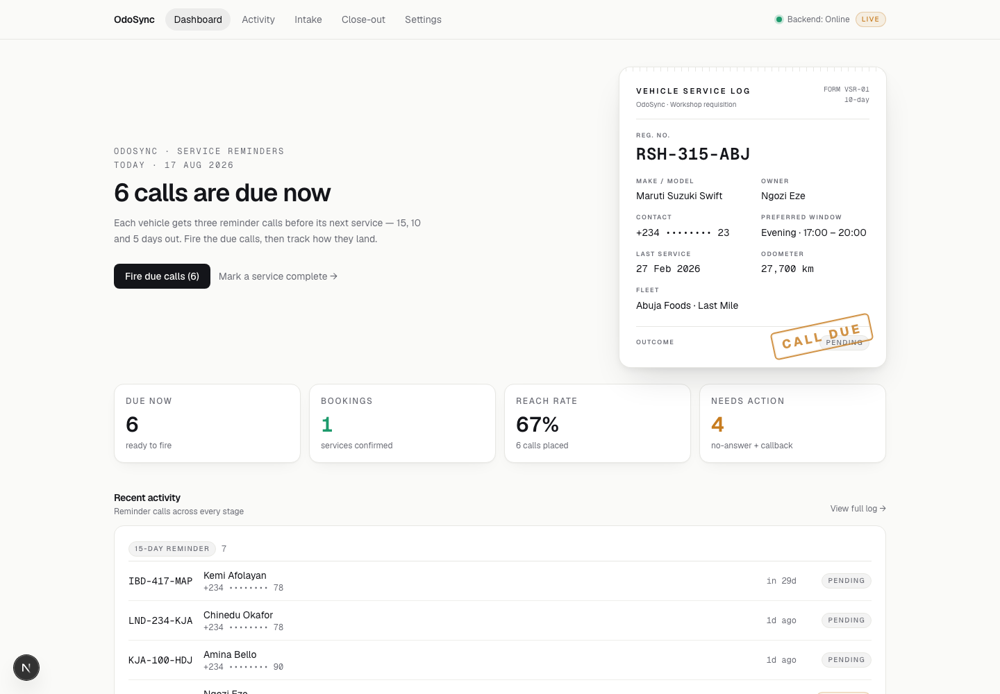
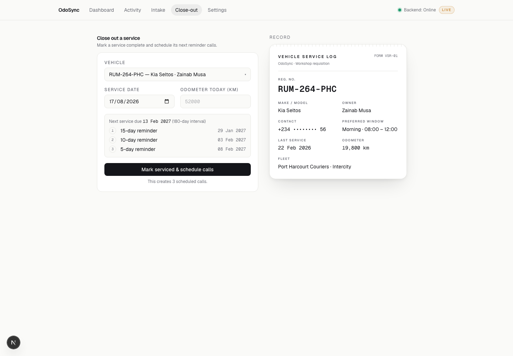
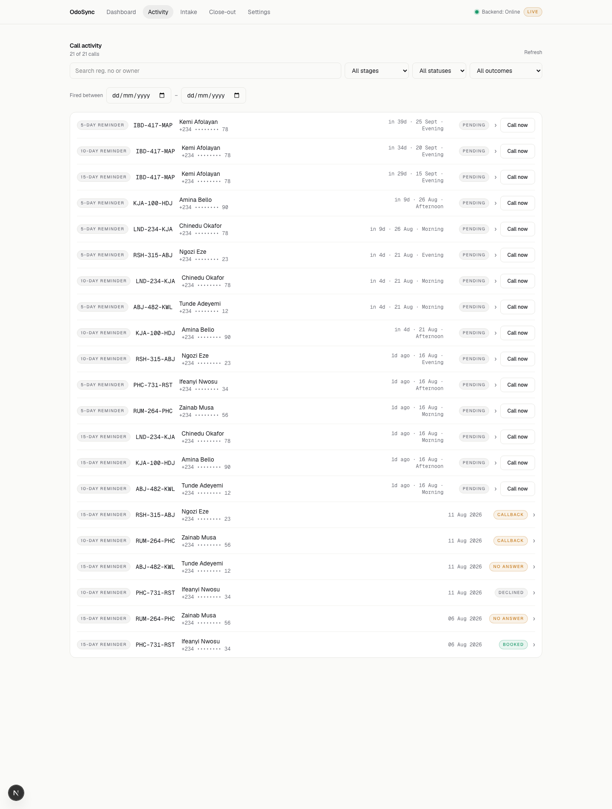
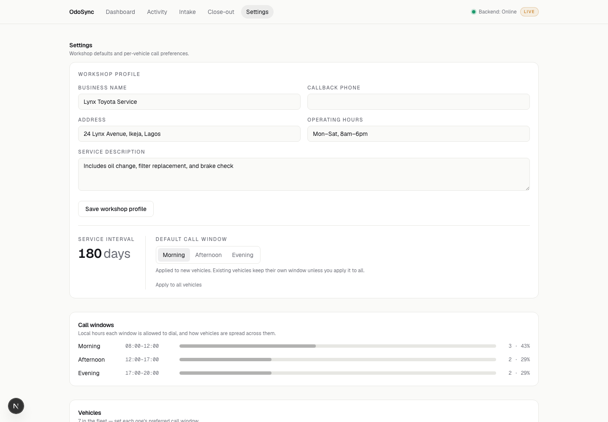

# OdoSync

Automated vehicle service reminders, built on [CALL-E](https://call-e.devpost.com/).

## Why I built this

Last year, during my industrial training, I worked at a Toyota-franchise
auto workshop as a mechanical engineering student. Every vehicle that came
in got logged by hand. And when it was time for the next service, someone
had to sit down with a ledger and start calling customers one by one — 15
days before it's due, then 10 days, then 5. That's the actual standard
these workshops follow.

I watched that happen over and over. It's slow, it's easy to lose track of
someone, and it just doesn't scale past a certain fleet size. So when I saw
the CALL-E hackathon, this was the obvious thing to build: something that
does that job automatically, with real phone calls, instead of someone
sitting with a phone and a spreadsheet.

That's OdoSync.

## Live demo

- App: [odosync.vercel.app](https://odosync.vercel.app)
- API health: [odosync-backend-production.up.railway.app/health](https://odosync-backend-production.up.railway.app/health)

The public demo runs CALL-E in dry-run mode so the seeded placeholder contacts
cannot receive outbound calls.

## How it works

OdoSync phones fleet-vehicle owners **ahead of their next service due date** to
book an appointment. For every vehicle it schedules three reminder calls — **15,
10 and 5 days** before the service is due — and places them (via
[CALL-E](https://github.com/CALLE-AI/call-e-integrations) AI calling) inside the
owner's preferred time window. Call outcomes (booked / declined / callback /
no-answer) are recorded, and completing a service ("close-out") rolls the cycle
forward to the next due date.

> **Status:** full-stack scaffold with **genuine** connections wired end-to-end
> (frontend → backend → PostgreSQL, node-cron scheduler, CALL-E integration).
> The UI is intentionally minimal — the frontend proves the wiring, not the
> design.

---

## Architecture

```
┌─────────────────────────┐        REST (fetch, CORS)        ┌──────────────────────────┐
│  Frontend (Next.js)      │  ───────────────────────────▶   │  Backend (Express API)     │
│  http://localhost:3000   │                                  │  http://localhost:4000     │
│  App Router · TS · TW    │  ◀───────────────────────────   │                            │
│  src/lib/api.ts = the    │           JSON                   │  ├─ /api/vehicles          │
│  single connection layer │                                  │  ├─ /api/close-out         │
└─────────────────────────┘                                  │  ├─ /api/call-jobs         │
                                                              │  ├─ /api/settings          │
                                                              │  ├─ node-cron scheduler ───┼─▶ fireDueCallJobs()
                                                              │  └─ @call-e/calle SDK ──────┼─▶ real call / dry-run
                                                              └─────────────┬──────────────┘
                                                                            │ Prisma
                                                                            ▼
                                                                   ┌──────────────────┐
                                                                   │   PostgreSQL      │
                                                                   └──────────────────┘
```

- **Frontend** is API-only: it has **no Next.js API routes**. Every byte of data
  is fetched from the backend over REST through the typed client in
  `frontend/src/lib/api.ts`, using `NEXT_PUBLIC_API_URL`.
- **Backend** is a standalone Express + TypeScript API (ESM). Prisma is the ORM.
- **Scheduler** is `node-cron` running **inside the backend process**, calling
  the internal `fireDueCallJobs()` function directly — no self-HTTP.
- **CALL-E** places real outbound calls only when `CALLE_API_KEY` is set;
  otherwise the backend runs in **DRY-RUN** mode and simulates every call.

---

## Product walkthrough

### Dashboard

The dashboard puts today's due-call queue, booking and reach metrics, and recent
fleet activity in one place.



### Close-out

Closing out a completed service advances the vehicle's service cycle. Before I
submit it, the UI previews the next due date and the exact 15-, 10-, and 5-day
reminder dates that will be written.



### Activity

Activity keeps pending jobs and real or simulated outcomes together, including
booked, callback, no-answer, and declined results. Pending rows can also be
fired or cancelled directly.



### Settings

The workshop profile and call-window defaults live in Postgres and feed the
next CALL-E task without requiring a backend restart.



---

## Prerequisites

- **Node.js ≥ 22** (required by the `@call-e/calle` SDK).
- **A PostgreSQL database.** Any of:
  - Local Docker (quickstart below), or
  - A hosted database (Neon, Supabase, etc.) — just use its connection string.

### PostgreSQL via Docker (optional quickstart)

```bash
docker run --name odosync-pg -e POSTGRES_USER=odosync \
  -e POSTGRES_PASSWORD=odosync -e POSTGRES_DB=odosync \
  -p 5432:5432 -d postgres:16
```

This matches the default `DATABASE_URL` in `backend/.env.example`.

---

## Setup

### 1. Backend

```bash
cd backend
npm install
cp .env.example .env          # then edit DATABASE_URL etc. as needed

npm run prisma:generate       # generate the Prisma client
npm run prisma:migrate        # create/apply the migration (dev)
npm run db:seed               # (optional) load demo fleet data
```

The seed also creates the database-backed workshop profile used in CALL-E
scripts. Change its name, address, hours, service description, and callback
number from the app's Settings screen. Saved changes apply to the next call
without restarting the backend.

Live CALL-E results also retain the CALL-E task ID, provider call ID, attempt
status, and provider failure code/message in Activity. Use those fields when a
call reaches a handset but disconnects immediately; `NO_ANSWER` alone is only
the normalized outcome and is not a provider diagnosis.

For a non-dev database (e.g. hosted), use `npm run prisma:deploy` instead of
`prisma:migrate` to apply existing migrations without prompting.

### 2. Frontend

```bash
cd frontend
npm install
cp .env.local.example .env.local   # NEXT_PUBLIC_API_URL=http://localhost:4000
```

---

## Running (two dev servers)

Open two terminals:

```bash
# Terminal 1 — backend API + in-process scheduler on :4000
cd backend && npm run dev

# Terminal 2 — frontend on :3000
cd frontend && npm run dev
```

Then open <http://localhost:3000>.

Confirm the backend is healthy:

```bash
curl http://localhost:4000/health
# {"ok":true,"service":"odosync-backend","db":"up","calle":"dry-run", ...}
```

---

## The scheduler

`node-cron` starts automatically inside the backend process (unless
`SCHEDULER_ENABLED=false`). On each tick it calls `fireDueCallJobs()`, which:

1. finds `PENDING` call jobs whose `scheduledFireDate <= now`,
2. skips any whose **preferred window** doesn't match the current hour
   (MORNING 08–12, AFTERNOON 12–17, EVENING 17–20 local time),
3. places (or simulates) the call, writes a `CallResult`, and marks the job
   `FIRED`.

You can also run it as a **separate process**:

```bash
cd backend && npm run scheduler
```

Or trigger a pass manually (great for demos — bypasses the window check):

```bash
curl -X POST http://localhost:4000/api/call-jobs/fire \
  -H 'Content-Type: application/json' -d '{"respectWindow":false}'
```

`SCHEDULER_CRON` controls the cadence (default `* * * * *`, i.e. every minute).

---

## CALL-E: dry-run vs live

| `CALLE_API_KEY` | Behaviour                                                             |
| --------------- | --------------------------------------------------------------------- |
| **empty**       | **DRY-RUN** — builds the real task/schema payload, logs it, and returns a simulated `BOOKED` result. **No real calls.** |
| **set**         | **LIVE** — uses `@call-e/calle` to place real outbound phone calls and extracts a structured outcome. |

Start in dry-run (the default) so you can exercise the whole system without
dialing anyone or needing credentials.

---

## Technical details

### Setup

Use the [Setup](#setup) and [Running](#running-two-dev-servers) instructions
above. They cover dependency installation, Prisma generation and migrations,
optional demo seeding, and both local processes.

### Side effects

This app places **real outbound phone calls to real people** when
`CALLE_API_KEY` is set and a call job fires, either manually through **Call
now** (or the firing API) or automatically through the scheduler. Normal app
use also writes vehicles, workshop settings, scheduled jobs, cancellations,
and call results to the app's PostgreSQL database. There are no external writes
beyond CALL-E and OdoSync's own Postgres database.

### Cancellation

Closing out a vehicle cancels all of that vehicle's existing `PENDING` jobs
before creating the next 15-, 10-, and 5-day cycle, which prevents duplicate
pending reminders. An individual pending job can be cancelled from its expanded
Activity row or directly with `POST /api/call-jobs/:id/cancel`. A job that has
already fired cannot be cancelled through OdoSync.

### Credential handling

`CALLE_API_KEY` and `DATABASE_URL` are read from environment variables only;
they are never hardcoded or committed. [`backend/.env.example`](backend/.env.example)
is the backend template, and `frontend/.env.local.example` is the frontend
template. The root and package `.gitignore` files exclude `.env`, `.env.local`,
and `.env.*.local` files.

### Dry-run behavior

With no `CALLE_API_KEY`, OdoSync runs in **DRY-RUN** mode. It constructs and
logs the same CALL-E task, recipients, result schema, and metadata payload that
live mode sends, then returns a deterministic simulated `BOOKED` result. The
same scheduler and persistence flow still runs, so jobs become `FIRED` and a
`CallResult` is stored without dialing anyone.

### Test coverage

Current verification: **9 backend tests** covering Nigerian phone routing and
normalization, CALL-E task construction, stage-specific scripts, and live
workshop-setting refresh. The backend test suite, typecheck, and production
build pass; the frontend lint and production build pass. There are not yet
automated API-route, scheduler, or browser tests.

---

## API reference

| Method | Path                          | Purpose                                               |
| ------ | ----------------------------- | ----------------------------------------------------- |
| GET    | `/health`                     | Liveness + DB check + CALL-E mode                     |
| GET    | `/api/vehicles`               | List vehicles (with call-job counts)                  |
| GET    | `/api/vehicles/:regnNo`       | One vehicle with its jobs + results                   |
| POST   | `/api/vehicles`               | Create a vehicle (intake)                             |
| PATCH  | `/api/vehicles/:regnNo`       | Update mutable vehicle fields                         |
| GET    | `/api/call-jobs`              | List jobs; filter `?status=&stage=&regnNo=`           |
| GET    | `/api/call-jobs/due`          | Preview jobs currently due (no firing)                |
| POST   | `/api/call-jobs/fire`         | Trigger a firing pass `{respectWindow?,regnNo?,limit?}` |
| GET    | `/api/call-jobs/:id`          | One job with vehicle + result                         |
| POST   | `/api/call-jobs/:id/cancel`   | Cancel a pending job                                  |
| POST   | `/api/close-out`              | Record a completed service → schedule next cycle      |
| GET    | `/api/settings`               | Window config + live distribution across vehicles     |
| PATCH  | `/api/settings`               | Set default window / bulk-apply a window              |

---

## Environment variables

| Variable | Required? | Purpose |
| --- | --- | --- |
| `DATABASE_URL` | Yes | PostgreSQL connection string used by Prisma. |
| `CALLE_API_KEY` | No | Enables live outbound calls. Empty or unset selects DRY-RUN mode. |
| `CALLE_BASE_URL` | No | Overrides the CALL-E SDK's default production API base URL. |
| `PORT` | No | Express listen port; defaults to `4000`. |
| `CORS_ORIGIN` | No | Browser origin allowed by Express CORS; defaults to `http://localhost:3000`. |
| `SCHEDULER_ENABLED` | No | Set to `false` to stop the scheduler from starting inside the API process; defaults to `true`. |
| `SCHEDULER_CRON` | No | Cron expression for due-job checks; defaults to every minute (`* * * * *`). |
| `SERVICE_INTERVAL_DAYS` | No | Days from a completed service to the next due date; defaults to `180`. |
| `NODE_ENV` | No | Uses quieter Prisma logging in `production`; normally set by the runtime/toolchain. |
| `NEXT_PUBLIC_API_URL` | No | Frontend-visible Express API base URL; defaults to `http://localhost:4000` and is embedded at frontend build/startup. |

---

## Troubleshooting

- **Railway database URLs:** Railway's private database URL works only between
  services on Railway's internal network. Local development needs the public
  proxy URL and port shown by Railway.
- **Restart after environment changes:** environment variables load when a
  process starts. Restart the backend after changing `backend/.env`, and restart
  or rebuild the frontend after changing `NEXT_PUBLIC_API_URL`; refreshing the
  browser is not enough.
- **Nigerian phone routing:** store Nigerian numbers in `+234` E.164 form (local
  `0...` numbers are normalized). OdoSync sends `region: "NG"` and
  `locale: "en-NG"` for `+234` recipients because those explicit hints make
  CALL-E delivery more reliable.

---

## Data model (Prisma)

- **Vehicle** — `regnNo` (PK), make/model, owner, phone (E.164), company,
  department, `lastServiceDate`, mileage, `preferredWindow`.
- **CallJob** — one per reminder stage (`FIFTEEN_DAY` / `TEN_DAY` / `FIVE_DAY`),
  with `scheduledFireDate`, `preferredWindow`, and `status`
  (`PENDING` / `FIRED` / `CANCELLED`).
- **CallResult** — one per fired job: `outcome`
  (`BOOKED` / `DECLINED` / `CALLBACK_REQUESTED` / `NO_ANSWER`),
  `proposedAppointmentDate`, `notes`.

See `backend/prisma/schema.prisma` for the authoritative schema.

---

## Repository layout

```
odosync/
├─ backend/           Express API, Prisma, node-cron scheduler, CALL-E wrapper
│  ├─ prisma/         schema.prisma, migrations, seed.ts
│  └─ src/
│     ├─ lib/         prisma, calle, scheduling, http helpers
│     ├─ routes/      vehicles, close-out, call-jobs, settings
│     ├─ scheduler/   run.ts (node-cron)
│     └─ server.ts    Express app + graceful shutdown
├─ frontend/          Next.js App Router (frontend-only)
│  └─ src/
│     ├─ lib/api.ts   typed REST client — the connection layer
│     ├─ components/  IntakeForm, DashboardStats, ActionList (scaffold)
│     └─ app/         dashboard, /intake, /settings
└─ docs/screenshots/  product walkthrough images
```

## Useful scripts

**Backend:** `npm run dev` · `build` · `start` · `typecheck` · `scheduler` ·
`prisma:generate` · `prisma:migrate` · `prisma:deploy` · `db:seed` · `db:reset`

**Frontend:** `npm run dev` · `build` · `start` · `lint`
